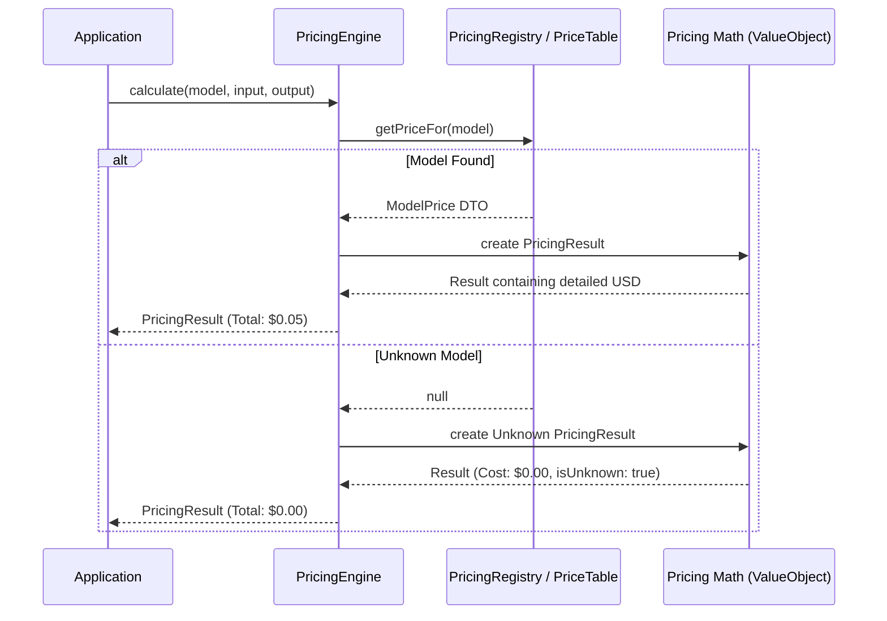
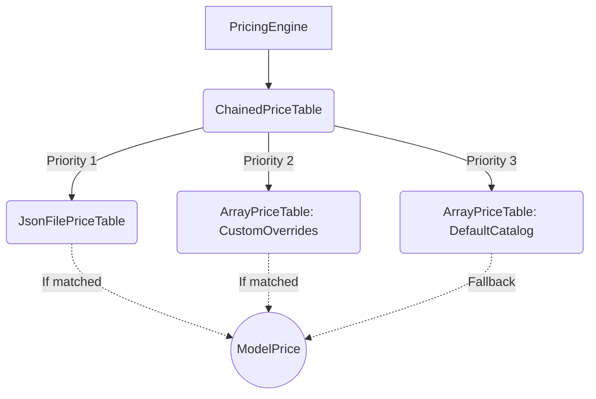
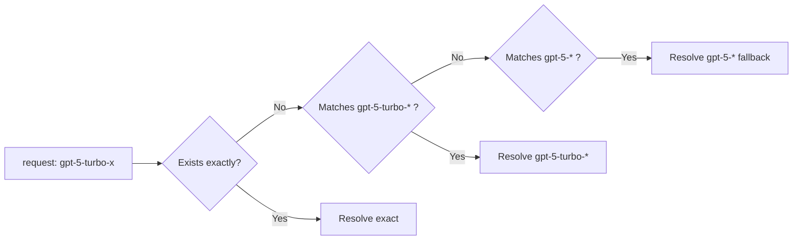

# Architecture & Design Patterns

The `nexus-ai-pricing` library is engineered to be **immutable**, **resilient**, and **extensible**. It leverages several key design patterns to ensure enterprise readiness.

## High-Level Flow diagram

## Core Components

### 1. `PricingEngine` (Facade)

The `PricingEngine` acts as the main facade. You don't need to manually orchestrate the tokenizers, result objects, or registries; you simply call `calculate()` or `estimate()` on the engine.
It supports static `PricingEngine::for('model')` for zero-config access, but implements `PricingEngineInterface` for DI containers.

### 2. `PriceTableInterface` vs `PricingRegistry`

There are two primary ways to resolve prices in this library: **Tables** and **Registries**.

- **Price Tables (`PriceTableInterface`)**: These define structural stores.
  - `ArrayPriceTable`: In-memory array mapping, supports glob patterns.
  - `JsonFilePriceTable`: Lazily reads overriding prices from a system file.
  - `ChainedPriceTable`: A **Decorator** pattern where you nest tables. It checks Table A; if null, it checks Table B.
  - `NullPriceTable`: A zero-cost sentinel that always returns `$0.00`. Ideal for test isolation where actual pricing is not under test.
- **Pricing Registry (`PricingRegistry`)**: The advanced enterprise implementation of `PriceTableInterface`. It enables **lazy factory Closures** that instantiate model prices only when explicitly requested.

### 3. Immutable Value Objects

- `ModelPrice`: Represents the $ per 1,000,000 tokens for completely distinct properties (`inputPerMillion`, `outputPerMillion`, `cacheWritePerMillion`, etc.).
- `PricingResult`: When returning the result of a cost calculation, the object is completely immutable. You cannot manipulate the tokens. If you need to accumulate costs over a loop, you call `$resultA->add($resultB)` which generates a brand-new `$resultC`, protecting state in asynchronous workers (like Laravel Horizon / Octane).

### 4. Glob Matching Logic

When resolving models, the library parses identifiers through a glob resolver. If you request `gpt-4o-2024-05-13`, the registry might not map it completely. Instead, `gpt-4o*` acts as a wildcard fallback.

### 5. Graceful Degradation Constraint

The engine strictly respects graceful degradation. Attempting to price an unsupported or unknown model will **never** throw a fatal exception. Instead, it generates a `$result` with zero costs but flags it internally as `isUnknownModel() = true`, enabling developers to log telemetry instead of triggering a fatal application error.

---

> **← Back:** [Installation & Setup](installation.md) · **Next:** [Pricing Engine Reference →](pricing-engine.md)
