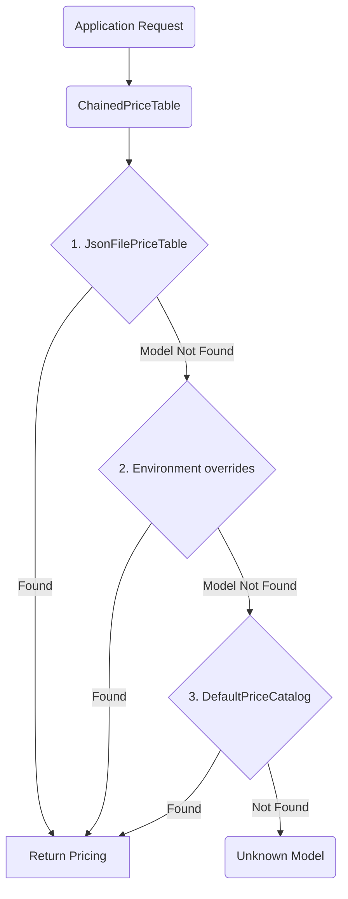

# Custom Price Tables

While the library includes a vast default catalog of standard LLM pricing, in enterprise environments you frequently negotiate custom rates, acquire specialized access points, or use privately hosted internal cluster models.

To avoid altering `.git` tracked files and vendor source files, the engine implements the `PriceTableInterface`.

## The Interfaces available

- `DefaultPriceCatalog`: Built-in mappings that follow standard public web pricing.
- `ArrayPriceTable`: Directly defining logic in your code.
- `JsonFilePriceTable`: System decoupled price definition.
- `ChainedPriceTable`: The Decorator overlay priority queue.
- `PricingRegistry`: Central container instance that allows lazy-loaded factories.

## Implementation: Chained Priority Lookup

The most resilient implementation acts like a cascade. You define an array of tables, and the system queries them sequentially from top to bottom.



```php
use Token27\NexusAI\Pricing\Engine\PricingEngine;
use Token27\NexusAI\Pricing\PriceTable\ChainedPriceTable;
use Token27\NexusAI\Pricing\PriceTable\ArrayPriceTable;
use Token27\NexusAI\Pricing\PriceTable\JsonFilePriceTable;

$table = new ChainedPriceTable(
    new JsonFilePriceTable('/etc/secrets/ai-special-prices.json'), // Priority 1
    new ArrayPriceTable(DefaultPriceCatalog::get()),               // Priority 2
);

$engine = PricingEngine::withTable($table);
```

## JSON Formatting Specification

When providing a `JsonFilePriceTable`, map out your files adhering to structure:

```json
[
  {
    "model": "my-internal-llm",
    "input_per_million": 1.50,
    "output_per_million": 5.00,
    "cache_write_per_million": 1.875,
    "cache_read_per_million": 0.15,
    "cache_read_is_subset_of_input": false,
    "notes": "Internal deployment"
  },
  {
    "model": "enterprise-*-gpt-*",
    "input_per_million": 2.00,
    "output_per_million": 8.00,
    "notes": "Glob pattern captures dozens of related variants. Example: enterprise-stage2-gpt-v4"
  }
]
```

## Overriding Prices Programmatically

There may be instances where a system spins up models on the fly (for example, fine-tuned LLaMas deployed onto an ad-hoc kubernetes cluster, and billed via compute time). You can inject those prices dynamically during runtime:

```php
use Token27\NexusAI\Pricing\ValueObject\ModelPrice;

$liveEngine = PricingEngine::for('fine-tuned-llama-7b');
// It doesn't exist yet, so it won't work perfectly.

$liveEngine->registerPrice(new ModelPrice(
    model: 'fine-tuned-llama-7b',
    inputPerMillion: 0.10,
    outputPerMillion: 0.30,
));

// Now the engine has the price override registered and calculates properly.
```

---

> **← Back:** [Vision & Multimodal Pricing](multimodal-vision.md) · **Next:** [Pricing Registry →](pricing-registry.md)
