# Flow Diagrams & Communication Architecture

Visual reference for understanding how `nexus-ai-pricing` processes requests, resolves prices, calculates costs, and integrates into production systems. All diagrams reflect the actual runtime behaviour of the library.

---

## 1. System Architecture Overview

High-level map of every component and how they relate to each other.

```mermaid
graph TB
    subgraph Entry["Entry Points"]
        SFA["PricingEngine::for('model')<br/>Static Facade"]
        WTB["PricingEngine::withTable()<br/>Custom Table Factory"]
        WRG["PricingEngine::withRegistry()<br/>Registry Factory"]
        WTK["PricingEngine::withTokenizer()<br/>Tokenizer Factory"]
        DIC["new PricingEngine(...)<br/>DI Constructor"]
    end

    subgraph Engine["Core Engine"]
        PE["PricingEngine<br/>(implements PricingEngineInterface)"]
        PB["PricingBuilder<br/>Fluent Binder (for / make)"]
    end

    subgraph Tables["Price Resolution Layer"]
        APT["ArrayPriceTable<br/>In-Memory + Glob"]
        JPT["JsonFilePriceTable<br/>Lazy-loaded JSON"]
        CPT["ChainedPriceTable<br/>Priority Decorator"]
        NPT["NullPriceTable<br/>Zero-cost Sentinel"]
        PRG["PricingRegistry<br/>Lazy Factory Container"]
        DPC["DefaultPriceCatalog<br/>50+ Built-in Models"]
    end

    subgraph Tokenizer["Text Estimation Layer"]
        TBA["TokenizerBridgeAdapter<br/>(wraps nexus-ai-tokenizer)"]
        TEI["TextEstimatorInterface<br/>Custom Estimator"]
    end

    subgraph ImageEst["Image Estimation Layer"]
        OAI["OpenAIImageEstimator<br/>512px Tile Formula"]
        ANT["AnthropicImageEstimator<br/>w×h / 750"]
        GEM["GeminiImageEstimator<br/>768px Tile Formula"]
        CUS["Custom Estimator<br/>ImageTokenEstimatorInterface"]
    end

    subgraph Results["Result Layer"]
        MP["ModelPrice DTO<br/>Immutable Price Descriptor"]
        PR["PricingResult<br/>Immutable Cost Result"]
        MM["MultimodalPricingResult<br/>Extends PricingResult + Images"]
    end

    SFA --> PB
    WTB --> PE
    WRG --> PE
    WTK --> PE
    DIC --> PE
    PE --> PB

    PE -->|"getPrice(model)"| CPT
    PE -->|"getPrice(model)"| APT
    PE -->|"getPrice(model)"| PRG
    CPT --> APT
    CPT --> JPT
    PRG -->|"loads"| DPC
    APT -->|"returns"| MP
    JPT -->|"returns"| MP
    PRG -->|"returns"| MP

    PE -->|"estimateTokenCount()"| TBA
    PE -->|"estimateTokenCount()"| TEI

    PE -->|"estimateImageTokens()"| OAI
    PE -->|"estimateImageTokens()"| ANT
    PE -->|"estimateImageTokens()"| GEM
    PE -->|"estimateImageTokens()"| CUS

    PE -->|"produces"| PR
    PE -->|"produces"| MM
```

---

## 2. Post-Request Billing Lifecycle

The most common usage pattern: you receive token counts from the LLM API and calculate exact costs.

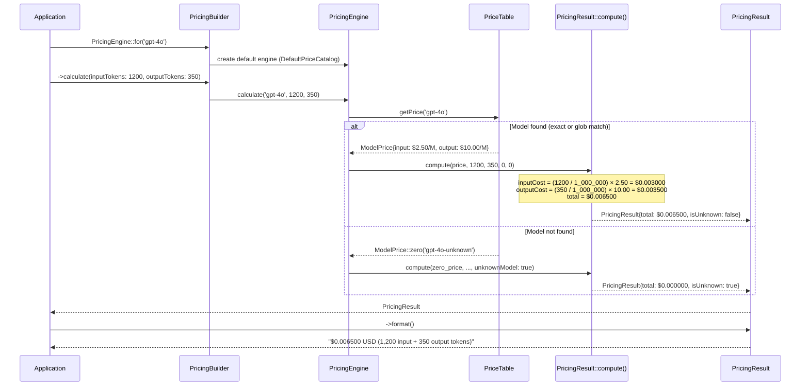

---

## 3. Pre-Request Estimation Lifecycle

Estimate the cost of a prompt **before** sending it to the API.

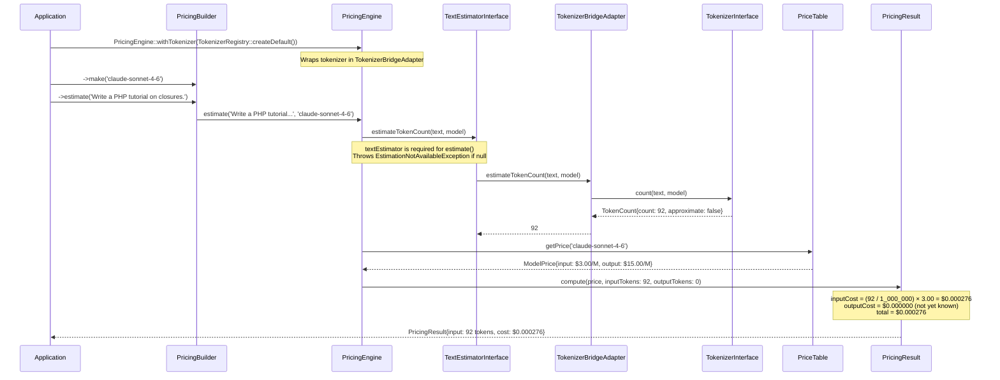

---

## 4. Price Resolution: ChainedPriceTable

How a `ChainedPriceTable` walks through its priority queue to find a model price.

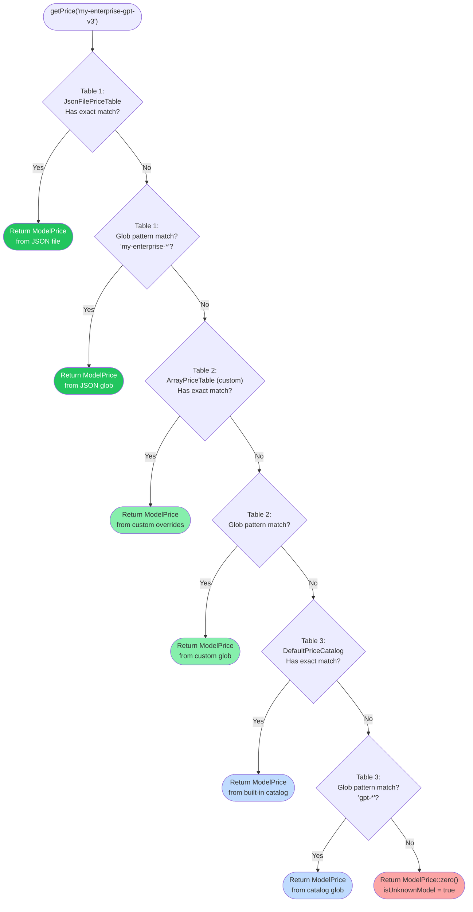

---

## 5. Glob Pattern Resolution Order

When multiple glob patterns could match the same model ID, the library picks the **most specific** (longest) match.

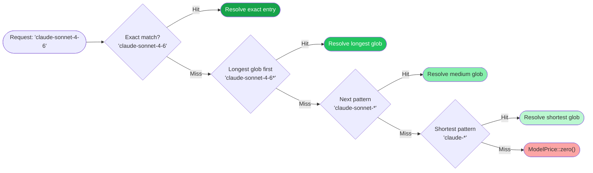

---

## 6. Anthropic vs OpenAI Caching Math

The fundamental billing difference between the two providers.

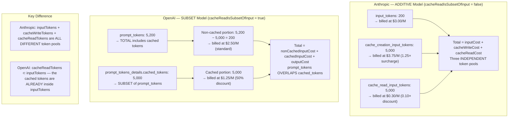

---

## 7. Caching Strategy Decision Flow

How the engine decides which math to apply based on `ModelPrice.cacheReadIsSubsetOfInput`.

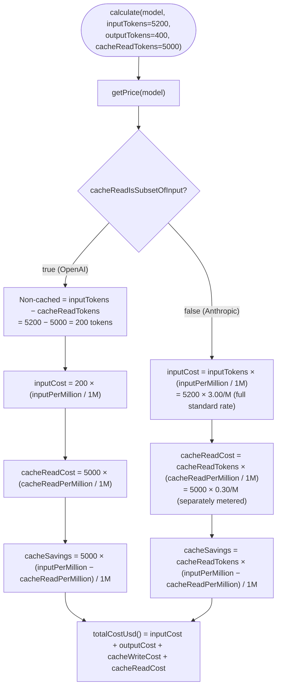

---

## 8. Image Token Estimation Pipeline

How `estimateWithImages()` converts image dimensions into token counts and costs.

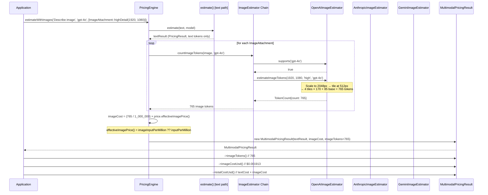

---

## 9. Image Estimator Fallback Chain

Resolution order when multiple estimators are registered.

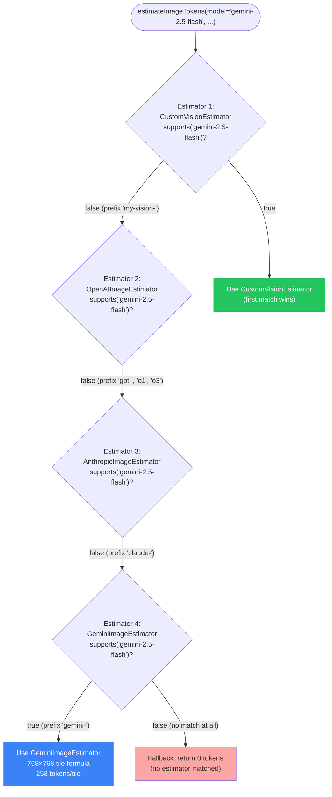

---

## 10. PricingRegistry Lazy Factory Resolution

How the `PricingRegistry` loads model prices on demand without pre-instantiating everything.

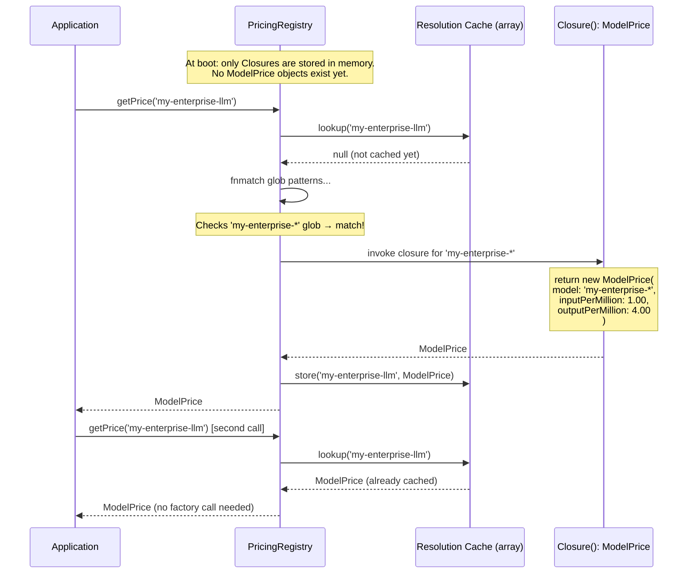

---

## 11. Tool-Calling Loop: Immutable Cost Accumulation

How `PricingResult::add()` accumulates costs across multiple LLM calls without mutating state.

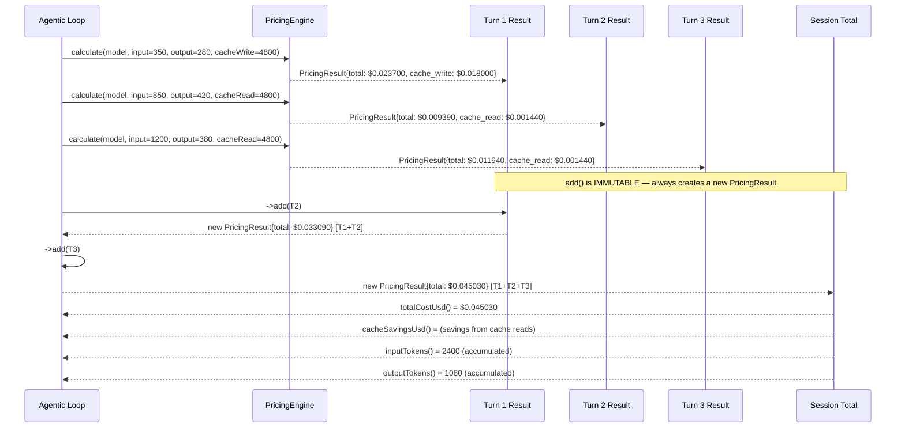

---

## 12. Pre-Request Budget Guard Pattern

A production pattern that checks cost before making the API call.

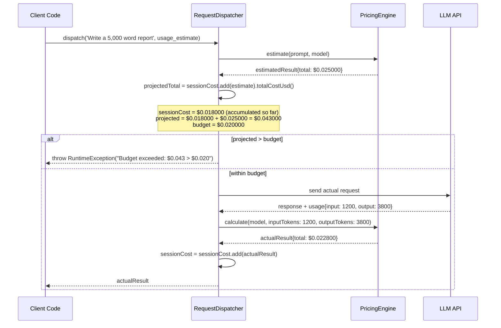

---

## 13. Dependency Injection: Three Injectable Axes

The three independent customisation points and how they compose.

```mermaid
graph TB
    subgraph Constructor["new PricingEngine(textEstimator, priceTable, imageEstimators)"]
        AX1["Axis 1: TextEstimatorInterface<br/>(text token counting)"]
        AX2["Axis 2: PriceTableInterface<br/>(price lookup)"]
        AX3["Axis 3: list&lt;ImageTokenEstimatorInterface&gt;<br/>(image token counting)"]
    end

    subgraph AX1Impl["Axis 1 Implementations"]
        TBA["TokenizerBridgeAdapter<br/>(wraps nexus-ai-tokenizer)"]
        CTE["Custom TextEstimatorInterface<br/>(your own implementation)"]
        NONE1["null<br/>(estimate() not available)"]
    end

    subgraph AX2Impl["Axis 2 Implementations"]
        APT["ArrayPriceTable<br/>(in-memory, glob patterns)"]
        JPT["JsonFilePriceTable<br/>(external JSON, no redeploy)"]
        CPT["ChainedPriceTable<br/>(priority delegation)"]
        PRG["PricingRegistry<br/>(lazy factories)"]
        NPT["NullPriceTable<br/>(test isolation)"]
    end

    subgraph AX3Impl["Axis 3 Implementations"]
        OAI2["OpenAIImageEstimator (built-in)"]
        ANT2["AnthropicImageEstimator (built-in)"]
        GEM2["GeminiImageEstimator (built-in)"]
        CUSTOM["Custom estimator(s)"]
        EMPTY["empty list → auto-load built-ins"]
    end

    AX1 --> TBA
    AX1 --> CTE
    AX1 --> NONE1
    AX2 --> APT
    AX2 --> JPT
    AX2 --> CPT
    AX2 --> PRG
    AX2 --> NPT
    AX3 --> OAI2
    AX3 --> ANT2
    AX3 --> GEM2
    AX3 --> CUSTOM
    AX3 --> EMPTY
```

---

## 14. PricingResult Value Object Immutability

How results are created, accessed, and combined without mutation.

```mermaid
stateDiagram-v2
    [*] --> Created: PricingResult::compute(price, tokens...)

    Created --> Accessed: read-only accessors\ntotalCostUsd(), inputTokens(),\ncacheSavingsUsd(), format(), toArray()

    Created --> Combined: ->add(otherResult)

    Combined --> NewResult: new PricingResult\n(tokens & costs summed)

    NewResult --> Accessed
    NewResult --> Combined

    Accessed --> [*]: no state mutation ever occurs

    note right of Created
        Immutable via PHP `readonly`
        Cannot be modified after construction
    end note

    note right of Combined
        Returns a NEW instance
        Original results unchanged
        Safe in async workers (Octane/Horizon)
    end note
```

---

## 15. Exception & Graceful Degradation Map

Which operations throw exceptions and which degrade gracefully.

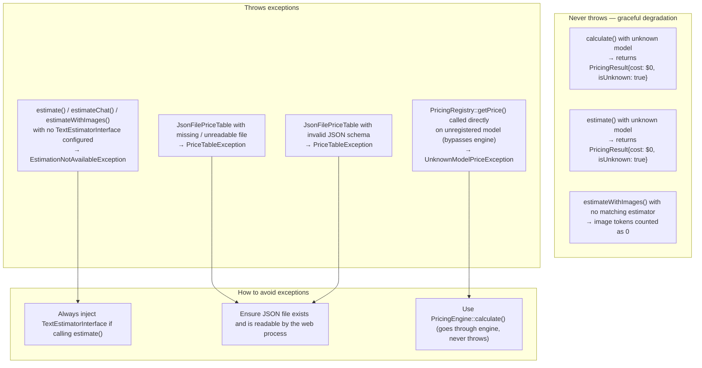

---

> **← Back:** [System Internals](internals.md) · **Next:** [Examples Guide →](examples.md)
