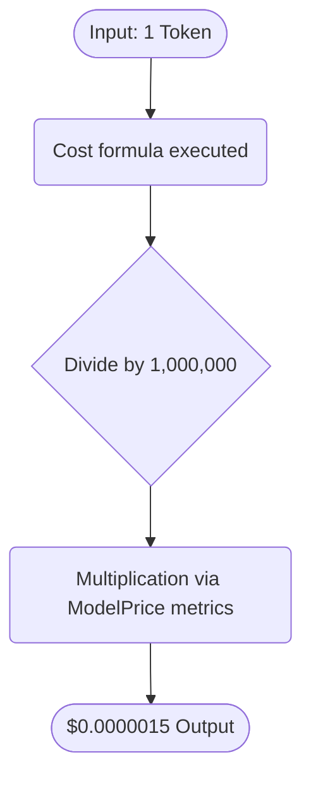

# System Internals & Logic Deep Dive

Understanding the library's sequence flow allows comprehensive manipulation of core structures and better diagnostic insights during deployment edge cases.

## Exceptions & Guards

While `calculate` ignores unregistered models gracefully, configuring the `PriceTableInterface` does not if poorly parameterized matrices are supplied.

- `PriceTableException`: Thrown if a `JsonFilePriceTable` fails JSON deserialization, lacks read access permissions, or detects an invalid schema.
- `UnknownModelPriceException`: Thrown **only** if bypassing the `PricingEngine` and calling a registry factory closure directly on an unregistered model. Never thrown through normal `PricingEngine` usage.
- `EstimationNotAvailableException`: Thrown when `estimate()`, `estimateChat()`, or `estimateWithImages()` is called but no `TextEstimatorInterface` was injected into the engine. Solution: use `PricingEngine::withTokenizer()` or inject `textEstimator: new TokenizerBridgeAdapter($registry)` via the constructor.

## Mathematical Precision Restrictions

AI Cost pricing operates on `$0.000XXX` fractional constraints (usually derived as prices 'Per Million' to mitigate floating-point imprecision logic in PHP).
The library normalizes computations under the hood:



It is highly recommended you utilize the formatted outputs instead of manually concatenating precision fractions:

```php
echo $result->format();         // "$0.006500 USD (1,200 input + 350 output tokens)"
echo $result->formatDetailed(); // verbose multi-line breakdown
```

---

> **← Back:** [Advanced Integration](advanced-integration.md) · **Next:** [Flow Diagrams →](flow-diagrams.md)
