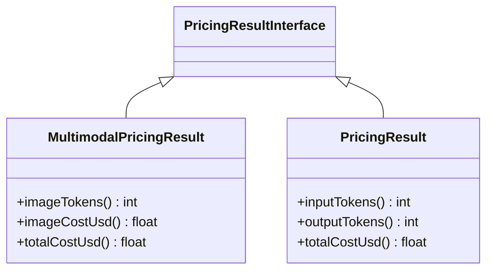

# Vision & Multimodal Pricing

Pricing simple text completion is relatively straightforward. Dealing with images introduces entirely different scaling rules logic on a provider-by-provider basis. The metric algorithms determining token cost for imagery deviate profoundly across ecosystems.

## Provider Disparities

1. **OpenAI**: Splits imagery into 512×512 tiles, paying a foundational base cost footprint plus a tile modifier depending on the `detail` flag parameter (`low`, `high`, `auto`).
2. **Anthropic**: Measures raw dimensions `(width × height) / 750` against the image boundaries.
3. **Gemini**: Enforces fixed 768×768 blocks at 258 tokens per tile.

This engine completely abstracts this visual chaos away by inheriting calculation mapping directly from the tokenizer library.

## Deep Dive: `MultimodalPricingResult`

When evaluating images, standard text `PricingResult` is abandoned for `MultimodalPricingResult` (which functionally encompasses all text requirements via extending it).



## Invoking Vision Processing

The engine accepts simple width, height, and detail parameters (as an `ImageAttachment` ValueObject type) and computes exact representations seamlessly.

```php
use Token27\NexusAI\Pricing\Engine\PricingEngine;
use Token27\NexusAI\Pricing\ValueObject\ImageAttachment;

$result = PricingEngine::for('gpt-4o')->estimateWithImages(
    text:   'Describe the key defects visible in this structural engineering PDF page.',
    images: [
        // Automatically delegates mathematical tile splits based on gpt-4o's specification.
        ImageAttachment::highDetail(width: 1920, height: 1080),  
        ImageAttachment::lowDetail(width: 800, height: 600),     
    ],
);

// Access entirely separate visual costs:
echo "Image processing alone costs: $" . $result->imageCostUsd();
echo "Combined sum of both text and image properties: $" . $result->totalCostUsd();
```

Because it seamlessly overrides standard functionality, the `MultimodalPricingResult` applies math specifically using `$price->imageInputPerMillion` correctly decoupled from standard `inputPerMillion` constraints before final output aggregation.

## Custom Image Estimators

The three built-in estimators (OpenAI, Anthropic, Gemini) are not hard-coded — they are the default value for the injectable `imageEstimators` constructor parameter. You can replace or extend them for proprietary models, adjusted formulas, or entirely new providers.

### Implementing `ImageTokenEstimatorInterface`

```php
use Token27\Tokenizer\Contract\ImageTokenEstimatorInterface;
use Token27\Tokenizer\Contract\TokenCountInterface;
use Token27\Tokenizer\ValueObject\TokenCount;

class MyVisionEstimator implements ImageTokenEstimatorInterface
{
    public function estimateImageTokens(int $widthPx, int $heightPx, string $detail, string $model): TokenCountInterface
    {
        // Your formula here — e.g. flat rate, megapixels, tiles, etc.
        $tokens = (int) ceil(($widthPx * $heightPx) / 600);

        return new TokenCount(
            count:       $tokens,
            model:       $model,
            strategy:    'my_formula',
            approximate: true,
        );
    }

    public function supports(string $model): bool
    {
        return str_starts_with($model, 'my-vision-');
    }
}
```

### Injecting via Constructor

```php
use Token27\NexusAI\Pricing\Engine\PricingEngine;
use Token27\Tokenizer\Vision\AnthropicImageEstimator;
use Token27\Tokenizer\Vision\GeminiImageEstimator;
use Token27\Tokenizer\Vision\OpenAIImageEstimator;

$engine = new PricingEngine(
    tokenizer:       TokenizerRegistry::createDefault(),
    priceTable:      new ArrayPriceTable([/* ... */]),
    imageEstimators: [
        new MyVisionEstimator(),       // proprietary model — checked first
        new OpenAIImageEstimator(),    // gpt-4o, o1, o3, …
        new AnthropicImageEstimator(), // claude-*
        new GeminiImageEstimator(),    // gemini-*
    ],
);
```

Resolution: the **first** estimator whose `supports($model)` returns `true` is used. The built-in `OpenAIImageEstimator` is the fallback if none matches. If you omit `imageEstimators` entirely, all three built-in estimators are used automatically.

### Common Patterns

| Pattern | When to use |
|---|---|
| **Flat rate** (`count: N`) | Provider bills a fixed number of tokens per image regardless of size |
| **Megapixel linear** (`w×h / K`) | Provider scales by raw pixel count |
| **Detail-aware tiling** | Different formula for `low` vs `high`/`auto` detail |
| **Override built-in** | Place your estimator before the built-in one for the same provider |
| **Model-family wildcard** | Use `str_starts_with($model, 'acme-')` to cover an entire family |

Full reference: `examples/10_custom_image_estimators.php`

---

> **← Back:** [Caching Strategies](caching-strategies.md) · **Next:** [Custom Price Tables →](custom-tables.md)
